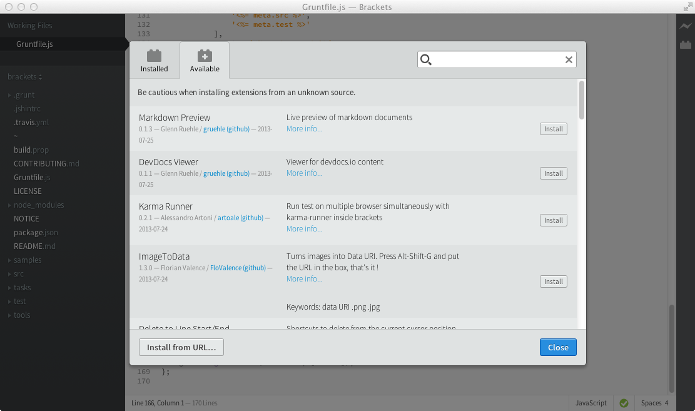

## Opening Extension Manager

Click on the icon that looks like this  near the upper-right corner of the window, or choose _File > Extension Manager..._

## Installing and Removing Extensions

You can browse a list of available extensions in the **Available** tab of the Extension Manager, and click **Install** to install an extension with one click. Use the filter field to search across the extension name, description, author, and all other fields.



#### The extension listing

The extension listing comes from the online [Brackets Extension Registry](https://registry.brackets.io). If you're an extension author, please [publish your extension to the registry](https://github.com/adobe/brackets/wiki/How-to-write-extensions#publishing-extensions) so it's available for others to find.


### Removing Extensions

Under the **Installed** tab, click on the Remove button to mark an extension for removal. When you close Extension Manager, Brackets will need to restart in order to finish removing the selected extensions. (You can save your work or choose to cancel the restart first. If you cancel the restart, you'll need to reselect the extensions extensions to remove later).

If an extension breaks Brackets to the point where Extension Manager is unusable, see the "Manual" section below to remove the extension.

### Updating Extensions

When an extension update is available, a green **Update** button will appear in the Installed tag. Updating extensions also requires a Brackets restart (see "Removing Extensions" above).


### Manual Install/Remove/Update

#### From a URL

* **Install** - Open Extension Manager and click the **Install from URL...** button at the bottom. Enter a URL to a ZIP file or the URL to a GitHub repo (if the extension doesn't require any special build/packaging).
* **Remove** - Use Extension Manager normally.
* **Update** - Click the "Install from URL..." button again and enter a URL to the updated version.


#### Directly on disk

1. Choose _Help > Show Extensions Folder_ (or [open it manually](https://github.com/adobe/brackets/wiki/Extension-Locations#user-extensions-folder))
2. Drill down to the `user` folder
3. Add/remove or update the set of extension folders as needed
4. Quit and re-launch Brackets


-----

## Old Extensions List ##

Some older Brackets extensions are not listed in Extension Manager. These extensions may no longer work in current versions of Brackets.

* [Quick Navigate](https://github.com/jeffslofish/quick-navigate): Navigate back to previous cursor and edit locations quickly with toolbar buttons.
* [Toolbar Horizontal](https://github.com/ruanmer/brackets-toolbar-horizontal): Move toolbar from vertical (right) to horizontal (top).
* [Auto-match pairs](https://github.com/zr0z/brackets-automatch-pairs): Auto-complete parenthesis, brackets, braces, double and single quotes.
* [Auto Formatter](https://github.com/shumpei/brackets-formatter-extension): Auto formatter for XML/HTML, CSS, JavaScript files.
* [Auto Indent](https://github.com/shumpei/brackets-autoindent-extension): Indent automatically for whole file.
* [Quote Converter](https://github.com/drewhjava/brackets-quoteconverter): Converts double to single quotes or single to double quotes
* [PHP QuickOpen](https://github.com/aonic/brackets-QuickOpenPHP): Adds PHP function definition support to QuickOpen search
* [MVC.net](https://github.com/edwinvankoppen/Brackets-MVC.net): Adds cshtml (views in MVC.net) to the HTML highlighting.
* [Ruby](https://github.com/TheresNoBox/Brackets-Ruby): Adds support for Haml, ERB, and Ruby line and block comments. 
* [Tabs](https://github.com/albertxing/brackets-tabs): Show tabs in place of title when sidebar is hidden
* [Parent Dir] (https://github.com/katsh/brackets-parent-dir): Show parent directory of opened files in the Working Set.
* [V8/Node Live Development](https://github.com/DennisKehrig/brackets-v8-node-live): Updates scripts running in Node.js as you type
* [Evaluate Clojure Expressions](https://github.com/yehohanan7/clj-brackets): Select any expression and evaluate it in wrepl
* [CSS Exclusion Shape Viewer](https://github.com/adobe/brackets-plugin-exclusions): Quick Edit on an exclusion shape definition in CSS displays the shape.
* [BracketLESS] (https://github.com/olsgreen/BracketLESS): Compiles LESS files to CSS on save
* [Open File from URL](https://github.com/deemeetar/OpenFileFromUrl): Opens any ```href``` and ```rel``` attribute urls in editor on ```ALT+0``` shortcut. Currently works only with existing files. 
* [Grunt for Brackets](https://github.com/markrendle/brackets-grunt): Run any task in your Gruntfile.js. (Uses Node. Tested on Brackets Sprint 25.)
* [Project Links](https://github.com/chrismatheson/brackets-project-links): Add some links to the sidebar for quick access **dev** still a lot of stuff i want to add
* [JSCompressor](https://github.com/slorenzot/brackets-jscompressor): This extension allows automatically compress javascript and css files using YUI compressor.
* [Docco](https://github.com/aghiura/brackets-docco): Runs [Docco](http://jashkenas.github.io/docco/) on a js file.
* [MDNLookup](https://github.com/pamelafox/brackets-MDNLookup-extension): Includes a way of creating an extensions toolbar and adding buttons to the toolbar with callbacks.
* [Bottom Browser](https://github.com/larz0/bottom-browser): Allows you to browse certain sites in the bottom panel and lets you do a Bing search on highlighted text by pressing Shift+Cmd+B.
* [Continuous Compilation](https://github.com/JoachimK/brackets-continuous-compilation): Displays JSLint error messages inline, highlighting infringing code and checking the code while you type.
* [PHPCS](https://github.com/jeffslofish/brackets-PHPCS-client): PHP_CodeSniffer for brackets. Lints your PHP through a web service.
* [complexityReport.js](https://github.com/sahlas/brackets-crjs): A Brackets extension that enables phil booth's complexityReport.js tool. Displays complexity statistics on a per-function and aggregate basis. 
* [Jasmine](https://github.com/dschaffe/brackets-jasmine): Runs the Jasmine-node unit test tool against the
current file.
* [MaDGe](https://github.com/sahlas/brackets-node-madge): An extension that enables node-madge functionality. Search for module dependencies, circular dependencies and more.
* [Snake](https://github.com/AboutWebLLC/brackets-snake): Because sometimes you need to eat your code.