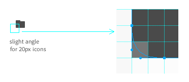
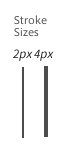
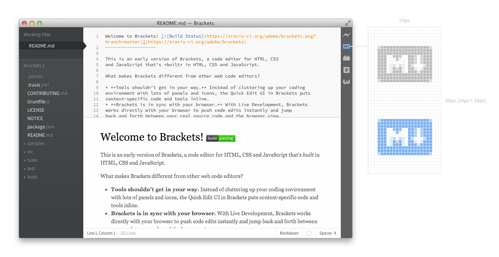

In Brackets, icons are used to:

* leverage globally understood visual concepts, or where icons usage is more conventional than text
* save space by using an easily understood symbol, where localization or text orientation is constrained
direct the user visually and break down or differentiate elements (i.e. feature lists)
* enforce consistency within the application
* make the interface visually engaging.

## Styleguide

* Use simple shapes that are not too detailed, use as less anchor points as possible
* Make sure it's flat i.e. without gradients, highlights, or shadows
* The corners are slightly rounded
* Use thinner lines rather than thicker lines
* Try to use SVG instead of PNG.






### Dimension  

* A single icon is 24px × 24px with 3px padding so that the largest solid square you should have is 18px × 18px.
* For sprites use a 24x24 grid.



### Use Colors to Indicate Extension State

The icon should be #BBBBBB by default.

* Inactive/disabled state has an opacity of 0.4 set in CSS on the default icon
* Green (#91CC41) for "everything is okay right now"/success state
* Blue (#78B2F2) for on/active state
* Yellow (#E3B551) for warning state
* Red (#F74687) for error state.

###Icon Template

[Download Extension Icon Template SVG](http://cl.ly/3L370g0k3l1j)

###CSS Example

```bat
#extension-name-icon {
    background-image: url(extension-name-sprite.svg);
}
 
#extension-name-icon.active {
    background-position: 0 -24px !important;
}
```


Ping @larz0 if you need help with your extension icon.