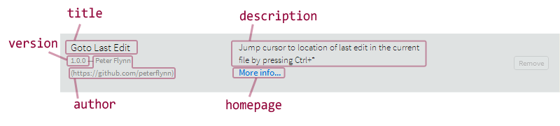

<font color="green">Status: Implemented</font>

The Brackets extension format is inspired by CommonJS and npm.  The format **_may change_** again in the future - see the ongoing [extension API research](https://trello.com/card/5-research-extension-api/4f90a6d98f77505d7940ce88/769).

## Package Files ##

A Brackets extension package is a zip file containing two components:
* main.js — extension entry-point module (see [[How to write extensions]])
* package.json — metadata (see below)

These two files may be nested inside a folder, but they must be inside the same folder.

If your extension is on GitHub, the zip files auto-generated by the "ZIP" download button at the top-left meet these requirements (<i>unless</i> you use git submodules). This is why Brackets can install an extension directly from a GitHub repo URL.

> npm uses gzipped tar files, but the standard for Brackets extensions is zip files because (1) they are more convenient for users to create on Windows and Mac; and (2) they can be created with a single click from GitHub. If greater compatibility with npm proves to be desirable, we can always repack the extensions into .tar.gz files.

## package.json Format ##

Brackets uses a format _similar_ to [npm's package.json format](https://npmjs.org/doc/json.html). Here's a quick example:

```json
{
    "name": "yourname.your-extension-id",
    "title": "Pretty Title for the UI",
    "description": "More useful details to let someone know what your extension is all about.",
    "homepage": "https://github.com/yourname/yourproject",
    "version": "1.0.0",
    "author": "Your Name <your@email> (http://your.url)",
    "license": "MIT",
    "engines": {
        "brackets": ">=0.24.0"
    },
    "i18n": [ "en", "fr"],
    "package-i18n": {
        "fr": {
            "description": "Plus de détails utiles pour laisser quelqu'un savoir ce que votre poste est tout au sujet."
        }
    }
}
```

**Required fields:** `name`, `version`

**Highly recommended:** `title`, `description`, `homepage`

Here's how these fields are exposed in the Extension Manager UI:


### Details ###

* `name` (<b>required</b>) - unique, lowercase alpha-numeric name without spaces; may include ".", "-", or "_". If you are adding a package.json to an existing extension, making the name field the same as the name of your GitHub repository will make the migration easier for people who already have the extension installed.
* `version` (<b>required</b>) - must follow the [Semantic Versioning format](http://semver.org/); typically a three-part version number of the form "x.y.z"
* `title` (<i>highly recommended</i>) - short user-visible display name of extension (a few words)
* `description` (<i>highly recommended</i>) - longer user-visible description of extension (a couple sentences)
* `engines.brackets` (encouraged) - which Brackets versions the extension is compatible with, specified as a string in [semver range format](https://github.com/isaacs/node-semver#ranges). Typically `>= 0.xx`, where "xx" is a Brackets sprint number (this says the extension won't run on older builds before sprint "xx", but it's assumed to be compatible with all future builds of Brackets)
* `homepage` (encouraged) - URL linking to more information (Extension Manager shows this as a "More Info" link)
* `author` (encouraged) - name of the developer, in the format "Name \<email> (URL)" (email and URL are both optional)
* `license` (optional) - license of the extension's source code (not shown in the UI yet)
* `keywords` (optional) - array of additional keyword strings; searched when the user filters the list view in Extension Manager
* `i18n` (optional) - array of language codes the extension has been translated into
* `package-i18n` (optional) - set of language translations to display in the Extension Manager dialog.  Each language can optionally provide a translation for the `title`, `description`, `homepage`, and/or `keywords`.

##### Future fields (<font color="red">not yet implemented</font>) #####

* `contributors` (optional) - array of strings or single string, in the same format as `author`
* `files` (optional) - will work the same as it does for npm, including the optional use of an `.npmignore` file
* Brackets does not yet support any of npm's dependencies-related features on installation. When we implement extension dependencies, those will likely be expressed as [`peerDependencies`](http://blog.nodejs.org/2013/02/07/peer-dependencies/)
* We should honor the `private` flag to not publish private extensions

> **note** by reusing `engines` and `peerDependencies`, we may run into friction with npm, assuming that we allow users to install and use npm modules. If need be, we can change to using two other Brackets-specific fields in package.json for these needs.

## Categories ##

<font color="red">Status: **Not yet implemented - may change**</font>

Our package.json files include a `categories` field which is not present in npm's format. Categories, unlike keywords, are primarily a "browsing" feature rather than a searching one.

The `categories` field can be either a string (the common case, since most extensions have only one), or an array of strings.

Each of the strings should be one of the following boldface values:

* **editing** – Editing and Navigation
* **snippets** – Snippets and Shorthand
* **formatting** – Formatting
* **codegen** – Code Generation
* **language** – Language Support
* **general** – General Functionality
* **livedev** – Live Development
* **visual** – Visual Editing
* **external** – External Tools and Online Content
* **docs** – Documentation
* **linting** – Linting and Warnings
* **testing** – Testing and Code Metrics

## Keywords ##

<font color="green">Status: Implemented</font>

Keywords can be anything that will help users find the right extension. Extension Manager searches `title`, `description`, _and_ `keywords` when filtering the list view.

Recommended: if your extension adds support for a specific language, include all its file extensions (with leading ".") in your keywords. (For example, an extension adding TypeScript support should include ".ts" in its keywords).

Keywords must be an array of keywords, not a simple list. For example:

    "keywords":["lint","linting","linter"]

## Extension Modules and main.js ##

<font color="green">Status: Implemented</font>

Brackets will automatically load the `main.js` module (RequireJS format) from the root of the package. Normally extensions are loaded during startup (see [application init order](https://github.com/adobe/brackets/wiki/Brackets-Development-How-Tos#application-init)). But when an extension is initially installed, the module is loaded immediately even though Brackets may have already been running for quite some time.

Modules that an extension imports via `require()` are located relative to the root of the extension. For example, `require("foo/bar")` will look for `foo/bar.js` in the extension. To import Brackets core modules, use `brackets.getModule()` instead (with a path relative to the Brackets src root).

## Node Modules ##

<font color="red">Status: **Not yet implemented - may change**</font>

Brackets extensions will be able to provide modules that run in a Node process. The exact location of these modules will depend on the answers to the open questions at the end of this section.

Brackets extensions will also be able to use modules downloaded via npm. The `node_modules` directory will be incorporated directly into the extension package. Including dependencies directly in a package for deployment [is considered a best practice](http://www.futurealoof.com/posts/nodemodules-in-git.html).

Node modules (or any modules for that matter) are *not* shared between extensions.

There are open questions surrounding the lifecycle of the Node code and the module format differences between Brackets and Node and these will be resolved as we head toward the Extension API research story.

**Open question: npm uses CommonJS modules, Brackets uses AMD, how do we reconcile?** This will be investigated during the extension API research. We have discussed a move to pure CommonJS modules.

## Changelog ##

<font color="red">Status: **Not yet implemented - may change**</font>

Changelogs will be formatted based on the proposed standard at [Keep a Changelog](http://keepachangelog.com/).  If there is a CHANGELOG.md file at the package root then the following sections will be identified by package manager and pulled apart to display to users:

* h2 sections (denoted by ##) are in the format: `## x.y.z - yyyy-mm-dd` and represent a released update using the semantic version number and the release date.
* h3 sections (denoted by ###) within an h2 release section will be labelled with 1-5 sub-section headers each with an un-ordered list of items for that sub-section.  The sub-section headings will be one of the following:
    - `Added` for new features.
    - `Deprecated` for once-stable features removed in upcoming releases.
    - `Removed` for deprecated features removed in this release.
    - `Fixed` for any bug fixes.
    - `Security` to invite users to upgrade in case of vulnerabilities.
* **Note** It is not necessary to include sub-section headers that are empty.

Examples of CHANGELOG.md files that follow this standard can be found at:

* [thephpleague/csvCHANGELOG.md](https://github.com/thephpleague/csv/blob/master/CHANGELOG.md)
* [olivierlacan/keep-a-changelog/CHANGELOG.md](https://github.com/olivierlacan/keep-a-changelog/blob/gh-pages/CHANGELOG.md)

## Unit Tests ##

<font color="green">Status: Implemented</font>

A [Jasmine unit test](http://pivotal.github.io/jasmine/) module can be located at `unittests.js` at the root of the package. In a [developer build of Brackets](https://github.com/adobe/brackets/wiki/How-to-Hack-on-Brackets#wiki-setup_for_hacking), where the _Debug > Run Tests_ menu item is enabled, the extension's `unittests.js` is automatically loaded and included in the list of runnable tests.

## Localization ##

<font color="green">Status: Implemented</font>

The pattern for localizing extensions is to put an `nls` directory at the root, containing a `strings.js` module. Next to that module, there is a `root` directory with the baseline set of strings and a directory for each locale's specific strings. See the [Localization Example extension](https://github.com/adobe/brackets/tree/master/src/extensions/samples/LocalizationExample).