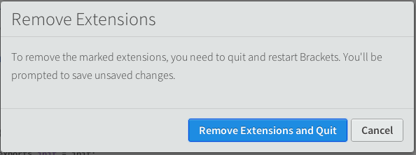
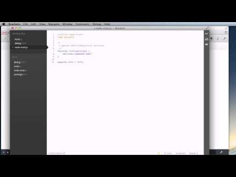
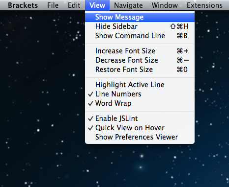
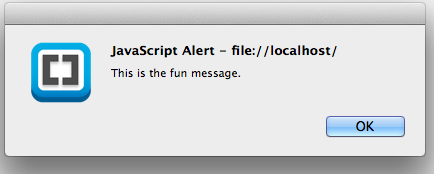
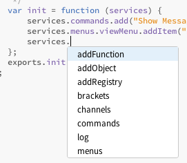
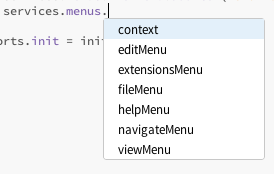
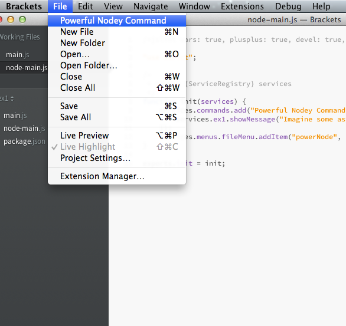

# Extension API Evolution #

Status: Proposal

Email comments to: dangoor@adobe.com

_This is **early research**. See [[Extension API Research]] for an updated proposal._

## Introduction ##

The Brackets extension API has been very successful as measured by the number and power of the extensions we have. We presently have two requirements that are not met by our current extension API:

* Ability to be "restartless" (not requiring a restart when disabling or updating an extension)
* Mechanism for sharing services between extensions

The need for restartlessness may not be obvious right now, but already in Sprint 25, the addition of the Extension Manager has started to show how the user experience of our current extension handling is suboptimal:



I have been working through some ideas on how to achieve these things and created a prototype that meets these requirements and provides other improvements as well. A simple example extension will show the proposed style.

Note that this proposal is about the *style* and *features* of the API and not about the exact calls that will be made. I expect that those calls will be worked out over time.

## See the Proposed Style in Action ##

I've made a screencast that shows off the new API style:

[](https://www.youtube.com/watch?v=RjJKsnfbI3M)

## Sample Extension ##

Adding commands and menu items is something that nearly every extension does, so I chose those two features for the sample extension. I didn't want a lot of other code to distract from the main proposal.

package.json:

```javascript
{
    "name": "ex1",
    "version": "1.0"
}
```

main.js

```javascript
/*jslint vars: true, plusplus: true, devel: true, nomen: true, indent: 4, maxerr: 50 */
/*global define, $, brackets */

define(function (require, exports, module) {
    "use strict";
    
    var CommandManager  = brackets.getModule("command/CommandManager"),
        Menus           = brackets.getModule("command/Menus");
    
    CommandManager.register("Show Message", "showMessage", function () {
        alert("This is the fun message.");
    });
    
    var viewMenu = Menus.getMenu(Menus.AppMenuBar.VIEW_MENU);
    viewMenu.addMenuItem("showMessage", null, Menus.FIRST);
});
```

As you can see, this extension is super simple. It adds a menu item:



which, when selected, pops up an alert:



This is not my finest moment in UI design. But, I hope you like the API.

## Restartless ##

The simplest thing we can do to make this extension restartless is to [define the extension lifecycle](https://trello.com/card/extensions-lifecycle-improvements/4f90a6d98f77505d7940ce88/647) such that the extension can clean up any bits it has attached to Brackets. In fact, we will certainly want to do this anyhow, because Brackets extensions will always be *able* to do things that we cannot automatically clean up.

Here's what it looks like in my prototype:

```javascript
/*jslint vars: true, plusplus: true, devel: true, nomen: true, indent: 4, maxerr: 50 */
/*global define, $, brackets */

define(function (require, exports, module) {
    "use strict";
    
    var CommandManager  = brackets.getModule("command/CommandManager"),
        Menus           = brackets.getModule("command/Menus");
    
    var load = function () {
        CommandManager.register("Show Message", "showMessage", function () {
            alert("This is the funnest message.");
        });
        
        var viewMenu = Menus.getMenu(Menus.AppMenuBar.VIEW_MENU);
        viewMenu.addMenuItem("showMessage", null, Menus.FIRST);
    };
    
    var unload = function () {
        var viewMenu = Menus.getMenu(Menus.AppMenuBar.VIEW_MENU);
        viewMenu.removeMenuItem("showMessage");
        CommandManager.unregister("showMessage");
    };
    
    exports.load = load;
    exports.unload = unload;
});
```

There's an `load` function that runs when the extension can attach its parts to Brackets and a `unload` function that runs when the extension is being disabled (either because the user wanted to disable the extension, the user is installing an update to the extension or the extension developer wanted to reload it).

Note: we currently have a module called AppInit that allows code to run on an `appReady` event (fired after `htmlReady` (the main template is rendered), the initial project is loaded and all extensions are loaded). We could expose appReady as another function that can be exported in main.js/node-main.js.

In the prototype, there's an Extensions menu with options to reload any extensions that appear to be reloadable. If you try it out, you'll find that you can change things like the name of the command or the message that appears, reload the extension and it works just fine. The prototype does have bugs. In the full implementation, we could offer an extension for extension developers that provides keyboard shortcuts for reloading the extension they're working on and things like that.

There are a couple of problems with the code above:

1. It's too easy to forget to clean something up. Computers are good at keeping track of things. Why don't we let the computer do it?
2. We can have less code than this, right?

## Less Code and Code Hints! ##

Here's where we make common extensions easier to write. The `load` function takes an argument which is a `ServiceRegistry` object, generally called `services`.

```javascript
/*jslint vars: true, plusplus: true, devel: true, nomen: true, indent: 4, maxerr: 50 */
/*global define, $, brackets */

define(function (require, exports, module) {
    "use strict";
    
    /*
     * @param {ServiceRegistry} services
     */
    var load = function (services) {
        services.commands.add("Show Message", "showMessage", function showMessage() {
            alert("This is the fun message.");
        });
        services.menus.viewMenu.addItem("showMessage", null, "first");
    };
    exports.load = load;
});
```

This code also works in a restartless way. The ServiceRegistry object keeps track of everything set up on behalf of the extension.

The specially formatted comment ([JSDoc](http://usejsdoc.org/) comment) in front of the load function tells Brackets' code hinting that the `services` parameter is a `ServiceRegistry` object. The prototype provides information about `ServiceRegistry` objects to the code hinting.





The code hinting can tell you all about the API of the common extension points of Brackets. Cool, no?

## Service Sharing ##

Beyond restartlessness, the second major feature missing from our current extension API is a mechanism that extensions can use for sharing services. The code hinting screenshots above provide a clue about how this API allows for sharing of services. If, for example, we wanted another extension to be able to access the amazing functionality of popping up an alert box, we could just do this:

```javascript
/*jslint vars: true, plusplus: true, devel: true, nomen: true, indent: 4, maxerr: 50 */
/*global define, $, brackets */

define(function (require, exports, module) {
    "use strict";
    
    function showMessage() {
        alert("This is the fun message.");
    }
    
    /*
     * @param {ServiceRegistry} services
     */
    var load = function (services) {
        services.commands.add("Show Message", "showMessage", showMessage);
        services.addFunction("ex1.showMessage", showMessage);
        services.menus.viewMenu.addItem("showMessage", null, "first");
    };
    exports.load = load;
});
```

In the example above, we've pulled the message display out into a separate function and then used `services.addFunction` to make that available elsewhere. If we start a new extension, code hinting will tell us about the function we've added:


In order for service sharing to work well, extensions need to be able to depend on the services provided by other extensions. To keep this simple, an extension would declare the extensions upon which it depends in `package.json`. Using `package.json` for this would allow the Extension Manager to automatically install required extensions. Note that the property used in `package.json` would be a different property than `dependencies` which will continue to have the same meaning it does for npm.

Important note: the intention of this mechanism is the sharing of *services*, not code. While you *could* hook up a library of functions to the `ServiceRegistry`, the real purpose of the registry is to connect *objects* in the running system. My proposal for sharing code is later in this document.

## Node ##

Brackets extensions gained some major superpowers recently with the addition of [Node.js](http://nodejs.org). Extensions can run external processes, access databases, perform file manipulations with ease and more thanks to Node and the [30,000+ packages in npm](https://npmjs.org/).

Brackets provides a fairly high-level interface to connect the Node "server" process with the Brackets "client" process. Here's an example with the [server side](https://github.com/dschaffe/brackets-jasmine/blob/master/node/JasmineDomain.js#L28) and [client side](https://github.com/dschaffe/brackets-jasmine/blob/master/main.js#L65) of the [brackets-jasmine](https://github.com/dschaffe/brackets-jasmine) extension.

One goal with my prototype was to provide a seamless and *consistent* interface between Brackets and Node. Let's change the `ex1.showMessage` function to accept an argument with the message to display:

```javascript
/*jslint vars: true, plusplus: true, devel: true, nomen: true, indent: 4, maxerr: 50 */
/*global define, $, brackets */

define(function (require, exports, module) {
    "use strict";
    
    function showMessage(message) {
        message = message || "This is the fun message";
        alert(message);
    }
    
    /*
     * @param {ServiceRegistry} services
     */
    var load = function (services) {
        services.commands.add("Show Message", "showMessage", showMessage);
        services.addFunction("ex1.showMessage", showMessage);
        services.menus.viewMenu.addItem("showMessage", null, "first");
    };
    exports.load = load;
});
```

Now, we create a file called `node-main.js` that sits next to our `main.js` file:

```javascript
/*jslint vars: true, plusplus: true, devel: true, nomen: true, indent: 4, maxerr: 50, node: true */

"use strict";

/*
 * @param {ServiceRegistry} services
 */
function load(services) {
    services.commands.add("Powerful Nodey Command", "powerNode", function () {
        services.ex1.showMessage("Imagine some async nodey goodness here.");
    });
    services.menus.fileMenu.addItem("powerNode", null, "first");
}

exports.load = load;
```

Though the code above looks *exactly* like the client-side Brackets code we've seen so far in this document, this code is running in Node. It defines a command and a menu item:



Here's how this works:

1. The user selects "Powerful Nodey Command" from the File menu
2. The client side calls the function for the command on the Node side
3. The Node side then calls *back* to the client to run the ex1.showMessage command with the new message to display
4. The client side displays the alert with the message provided by the Node side

Calls between the client side and Node are limited to JSON-compatible objects, *except* there is special support for functions in order to make cases like the one above work.

## Web Workers and Sandboxes ##

The `ServiceRegistry` is synchronized between the client side and the Node side. It would be possible to fire up a Web Worker to perform background computation on the client side and synchronize a `ServiceRegistry` there in order to provide the same kind of seamless interface that you see with Node.

Though we want Brackets extensions to have the kind of unfettered access to Brackets that has enabled them to do so much, this same mechanism could also be used to create restricted execution sandboxes in which to run untrusted extensions.

## Not Crossing the Border ##

Not everything can be conveniently made asynchronous or readily converted to JSON. If a service can't work across an async border or a function's result can't be turned into JSON, it will not "cross the border" between Node and the Client.

One possible example:

```javascript
var text = services.editor.getSelectedText();
var doc = services.editor.getDocument();
```

The first function could be made available everywhere, whereas the second (which returns a complex object full of methods and such) would be limited to client side only. The Node code would not even see `services.editor.getDocument`.

Note that the prototype does not implement this feature, but it will absolutely be required early in the development of the API.

## Code Sharing ##

In the section on Service Sharing, I suggested that the `ServiceRegistry` is intended to connect up objects in the running system and not just share libraries of functions. So, how *should* extensions share code?

Many packaging systems have been built over the years, each of which had their own good and bad points. Many suffered from issues of different pieces of code relying upon different versions of libraries. This is generally called ["dependency hell"](http://en.wikipedia.org/wiki/Dependency_hell).

npm and Node have actually solved dependency hell. Each package will get the version of a given library that it needs. What if we could just use a common module format and npm to share code?

We can. In fact, in the prototype, we can change main.js to:

```javascript
/*jslint vars: true, plusplus: true, devel: true, nomen: true, indent: 4, maxerr: 50, node: true */
/*global define, $, brackets */

"use strict";

function showMessage(message) {
    message = message || "This is the fun message";
    alert(message);
}

/*
 * @param {ServiceRegistry} services
 */
var load = function (services) {
    services.commands.add("Show Message", "showMessage", showMessage);
    services.addFunction("ex1.showMessage", showMessage);
    services.menus.viewMenu.addItem("showMessage", null, "first");
};
exports.load = load;
```

No more `define` call at the top. In the prototype, an extension can share a single code module between the client side and Node. This works using [Cajon](https://github.com/requirejs/cajon). A better solution would be to create a module loader for Brackets that follows the [Node module resolution rules](http://nodejs.org/api/modules.html#modules_all_together). By doing that, extension authors can just use `npm install` to get libraries that work in both Brackets client side and the Brackets node server.

Making this change opens up Brackets to a lot of pre-built functionalty, but doesn't sacrifice our ability to run Brackets in the browser thanks to projects like [Browserify](http://browserify.org/).

## Decoupling, Dependency Injection and Unit Testing in the Core ##

Major separate parts of the Brackets client core would use the `ServiceRegistry` to expose their services to extensions, but this can also be the mechanism used to connect the major subsystems (the various "managers"). If each subsystem is provided with its `ServiceRegistry` "from the outside", it could be given a registry that is designed for testing and mocks out other subsystems. This kind of design is commonly referred to as [dependency injection](http://en.wikipedia.org/wiki/Dependency_injection).

## Backwards Compatibility and Full Access ##

`brackets.getModule` would still be available, as would access to the DOM. Brackets extensions will have all of the power that they have today to tweak anything they want. The proposal here is to build a new extension API that provides a façade giving extensions:

1. Restartlessness without extra bookkeeping
2. A mechanism for code sharing between extensions
3. Code hinting with detailed information about the extension API
4. Seamless integration with Node

## Availability and Limitations of the Prototype ##

The prototype is available in the [dangoor/extensions3 branch](https://github.com/adobe/brackets/tree/dangoor/extensions3) of the Brackets repository. The current code is actually the second iteration of this particular design and likely does not need to be thrown away to build out the "real" implementation. It was, however, built quickly and needs work. Here's a list of limitations that comes to mind:

1. Clean up/comment/more tests. A chunk of the code in `extensibility/ExtensionData` was built using TDD, but more tests would be good.
2. Implement return values when Node calls the client. The prototype "cheats" by using the features of the existing Node support when some extension of the protocol is likely in order.
3. Cleaner API for restarting extension. Right now, the responsibility for restarting an extension is split between `ExtensionLoader` and `command/Menus`(!)
4. Flesh out code hinting. I'd like to see a lot of documentation available via hinting. Right now, the hinting just knows about the existence of objects and functions in the `ServiceRegistry`.
5. Command/menu registries store their information directly in the `ServiceRegistry`. Ideally, you should be able to type `services.commands.commandId.execute()` to run a command. Currently, though, commands and menus are maintaining their own registries and using subscribing to events that let them know when to clean up.
6. In order for extensions to truly share services, we need to implement extension dependencies so that one extension can fire up after another one has completed its own initialization.
7. Parts of Brackets core that depend on services provided by other parts need to know when those services have become available (some mechanism like AppInit or extension dependencies)
8. Fix the lifecycle. `ExtensionLoader` right now depends on things like `package.json` in order to fully fire things up. That just needs to be cleaned up.
9. Async function calling. Anything that crosses the border between the client side and Node needs to be asynchronous. It would be easy to implement a wrapper that makes calls that *could* be synchronous asynchronous allowing a single piece of code to be shared between the client side and Node easily.
10. One-time callbacks. Functions passed between Node and the client side are maintained in a special `__callbacks` part of the `ServiceRegistry`. Functions added there are currently only removed when a given extension is removed. Some control over the lifespan of these remotable functions will be needed.
11. Hierarchical pub/sub. `ServiceRegistry` includes a built-in publish/subscribe system. You can define nested "channels", but you can currently only subscribe to the leaf nodes. For example, you can subscribe to "brackets.extension.loaded", but you can't subscribe to "brackets.extension" to get all messages about extensions.
12. There are bugs. Reloading is really new, for example, and sometimes just doesn't work as it should.
13. Ability to mark whether a piece of the API is available across `ServiceRegistry` boundaries. For example, a `Document` object would not be able to move transparently from the client side to Node, so an API that returns or uses a `Document` should be marked as local only.

Many of the items above are actually things that would be ironed out as we design real APIs for the Brackets subsystems. Assuming this general model is accepted, one more task is to define the actual APIs we would like to see for the commonly-used extension APIs.

That probably looks like a lot of work. However, both iterations of the current prototype were built in probably a week's worth of work. Further, everything above does not need to be built in one go. This is a project that can be built out iteratively, though we will want to be careful about crafting pleasing and consistent APIs for the extension developers.

In conclusion, I think this API design offers real benefits for Brackets users (restartlessness) and extension developers.


# Extension API Specifics #

The first part of this document described features of a new extension API and a prototype that implemented those features. In this section, we start to drill in to the specifics of the new extension API.

## Namespacing ##

Services provided by the Brackets core can be made available via a separate namespace so that it's clear to extension developers which services they're using that require a different extension to be installed in order to work. Namespacing core features will also help avoid collisions between features that all Brackets extension developers rely on and services provided by specific extensions.

## Return Values ##

API design [can be tricky](http://queue.acm.org/detail.cfm?id=1255422) because you need to balance ease of use, conciseness and power. This API opens up the possibility of seamless sharing of code between Brackets client side and Node (and, by extension, Web Workers and sandboxes). But, there's an asynchronous border between those different environments. We *could* make it so that all APIs that return values are asynchronous. But, this will make writing many extensions less convenient than it was before:

```javascript
services.editor.getDocument().then(function (doc) {
    services.editor.getCursorPosition.then(function (pos) {
        // do stuff with doc and pos
    });
});
```

And, in the case above, we're actually making it less convenient *for no benefit other than consistency*, because a `Document` object (as it exists today) won't be able to cross the JSON boundary between Node and the client side.

A better approach is to make APIs synchronous where possible, allowing extensions that work with `Document`s, for example, to continue being as easy to write as they are today. To improve on the situation we have today, `ServiceRegistry.addFunction` can allow for optional documentation that feeds straight into the code hinting, possibly in [Tern's format](http://ternjs.net/doc/manual.html#typedef). If the return type is a `Promise`, then the function is assumed to be async, otherwise it's assumed to be synchronous.

But, what about this case:

```javascript
var text = services.editor.getSelectedText();
```

That's a call that would be nice to have synchronous on the client side, but could also work on the Node side because text is JSONifiable. Here are two options for dealing with this:

1. We could certainly have `services.editor.getSelectedText()` return a `Promise` when called in Node. If you want code to work on both client side and server side, you could do something like this:

```javascript
Q.when(services.editor.getSelectedText(), function (text) {
    // do something with the text
});
```

This is using the idiom provided by [Q](https://github.com/kriskowal/q), which appears to be different from jQuery's `$.when`... but the idea is simple, if the first argument to `when` is a promise, wait for it to be resolved and then call the function. If it's a value, just call the function with the value.

2. We could provide a convenience on `ServiceRegistry` that ensured that the return is always handled asynchronously. For example,

```javascript
var services = services.async;
services.editor.getSelectedText().then(function (text) {
    // do something with the text
});
```

In this example, the user has explicitly said that they want all of the functions to be async and are guaranteed to get a promise back from any call with a return value.

These two approaches are basically equivalent (the second way just tucks the `Q.when` call into the `ServiceRegistry` machinery) and I have no strong feelings about it. My inclination is more toward the second approach as it gives the API a consistent feel for those who are writing a module for use both on the client side and Node.