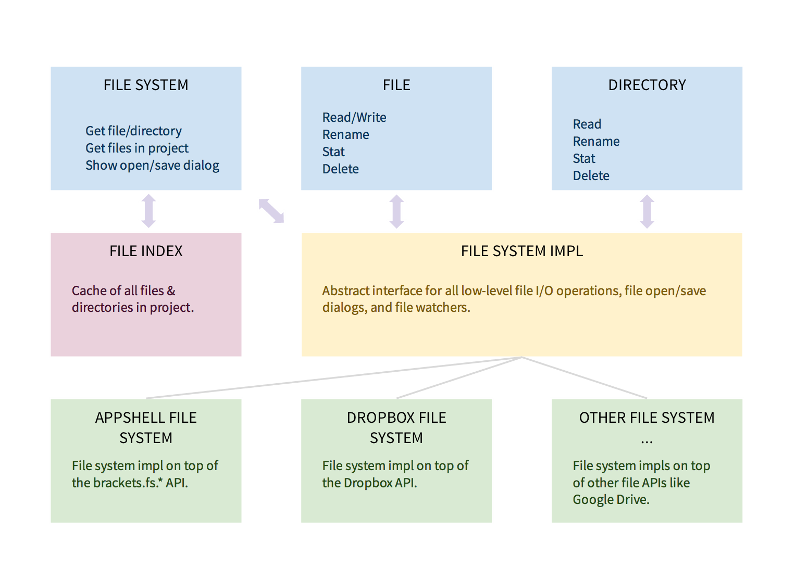

# File System Evolution #

## Status ##
[Landed](https://github.com/adobe/brackets/pull/5797) in Brackets Sprint 34!

## Motivation ##

The old file system APIs in Brackets were a bit chaotic, and usage was inconsistent. Here are just a few issues:

* No centralized file system model. This makes it difficult to add file watchers, and update all file references in the app after operations like rename.
* Inefficient. We constantly hit the disk to read timestamps, content, etc.
* Two APIs for file i/o: `brackets.fs` and `NativeFileSystem`
* Incorrect creation of `FileEntry` objects (these should never be directly instantiated)
* No way to use alternate storage--Dropbox, Google Drive, etc.

For more background, [read this forum post](https://groups.google.com/d/msg/brackets-dev/95PyDKfMO0M/Lw9tBoBDUWwJ).

## Overview ##

The high-level goals of the new file system are:

* Clean, consistent API.
* Unified file system model, including file watchers.
* High Performance. Only hit the disk when we need to.
* Ability to swap out low-level I/O routines (for cloud storage, etc.).

Here is a block diagram of the major parts:

Clients only interact with the blue boxes. The green boxes represent low-level file i/o implementations, which can be added as extensions. The red box replaces the old `FileIndexManager` functionality, and does not have a public API (indexed files are accessed through `FileSystem`).

### Basic Usage ###
There are a few basic rules for using the new file system.

* Persist full pathnames, but convert into `File` and `Directory` objects for in-memory use. Creating `File` and `Directory` objects is cheap so there is no need to worry about performance.
* Paths use `/` separators regardless of platform. Paths begin with `/` on Mac/Linux and `c:/` (or similar) on Windows. FileSystem normalizes paths to guarantee that paths to a directory always end in a trailing `/`.
* There is a forced 1:1 relationship between `File` and `Directory` objects and their representation on disk. If two pieces of code ask the `FileSystem` for the same file path, they will both be returned the same `File` object.
* Listen for `"change"` events on `FileSystem` to be notified of file or directory changes. 
* When caching file (or directory) related data, you should use the file.id property as the key, and _not_ the file.fullPath. The path of a file is subject to change if any of its parent directories are renamed.

##API##

For a guide to converting from current Brackets file APIs to these new APIs, see [[File System API Migration]].

### FileSystem ###
The main module is `FileSystem`. This is the public API for getting files and directories, showing open/save dialogs, and getting notified about file system changes.

[/src/filesystem/FileSystem.js](https://github.com/adobe/brackets/blob/master/src/filesystem/FileSystem.js)

###FileSystemEntry###
This is an abstract representation of a FileSystem entry, and the base class for the `File` and `Directory` classes. FileSystemEntry objects are never created directly by client code. Use `FileSystem.getFileForPath()`, `FileSystem.getDirectoryForPath()`, or `Directory.getContents()` to create the entry.

[/src/filesystem/FileSystemEntry.js](https://github.com/adobe/brackets/blob/master/src/filesystem/FileSystemEntry.js)

###File###
This class represents a file on disk (this could be a local disk or cloud storage). This is a subclass of `FileSystemEntry`.

[/src/filesystem/File.js](https://github.com/adobe/brackets/blob/master/src/filesystem/File.js)

###Directory###
This class represents a directory on disk (this could be a local disk or cloud storage). This is a subclass of `FileSystemEntry`.

[/src/filesystem/Directory.js](https://github.com/adobe/brackets/blob/master/src/filesystem/Directory.js)

##Performance & Caching##
The main performance gains come from caching. The file system provides two caching levels:

* File contents & metadata - reads are guaranteed to be up to date. Caches may be used to reduce bandwidth, but we always ping the impl and wait to ensure the cached copy is the latest.
* Directory structure / file listing - reads are fast, but may not reflect external changes quickly. Cached info is returned immediately without waiting for the underlying storage impl.

In both cases, changes made _via the file system's own APIs_ are always reflected immediately (as soon as the operation's callback signals success).

##Change Events##
`FileSystem` dispatches a `"change"` event whenever a file or directory changes on disk. This event is passed an `entry` parameter, which loosely describes the type of change:

* a `File` object - the file's contents have changed
* a `Directory` object - one or more of the directory's immediate children have been created, deleted, renamed/move, or otherwise changed. (This could include a subdirectory being created/deleted, but not changes to items _within_ a subdirectory).
* `null` - a "wholesale" change has occurred and listeners should assume everything in the file hierarchy may have changed

For _external_ changes, there may be a significant delay before a "change" event is dispatched (file watchers may be unreliable or laggy). But changes made via the file system's _own_ APIs dispatch a "change" event immediately, after the operation in question finishes running its callback.

> Note: It's always fine as a (less-performant) shortcut to treat change notifications as if they were less fine-grained. For example, the prototype refreshes the entire folder tree view whenever any Directory is passed with a change event. This is overkill, but simpler to implement than only refreshing the affected part of the tree.

##Performance Numbers##
Performance numbers between the old file system and new file system. 

**Note:** These are the baseline numbers that do _not_ include file caching or file watchers.

<table>
  <thead>
    <tr>
      <th>test</th>
      <th>old file system</th>
      <th>new file system</th>
      <th>difference</th>
    </tr>
  </thead>
  <tbody>
    <tr>
      <td>Open File</td>
      <td>194ms</td>
      <td>182ms</td>
      <td>6.5% improvement</td>
    </tr>
    <tr>
      <td>Load Project</td>
      <td>631ms</td>
      <td>705ms</td>
      <td>12% regression</td>
    </tr>
    <tr>
      <td>Find in Files</td>
      <td>2749ms</td>
      <td>1568ms</td>
      <td>43% improvement</td>
    </tr>
    <tr>
      <td>JS Code Hints</td>
      <td>61ms</td>
      <td>63ms</td>
      <td>3% regression</td>
    </tr>
    <tr>
      <td>Quick Open</td>
      <td>55ms</td>
      <td>64ms</td>
      <td>15% regression</td>
    </tr>
    <tr>
      <td>Memory Usage</td>
      <td>39MB</td>
      <td>37.4MB</td>
      <td>3% improvement</td>
    </tr>
  </tbody>
</table>
All numbers are averaged over several runs. Memory usage taken after opening JSCode hints and performing "Find in Files". The load project regression is due to additional work at project load time. This work results in significantly faster initial time for "quick open" (not reflected in these numbers).