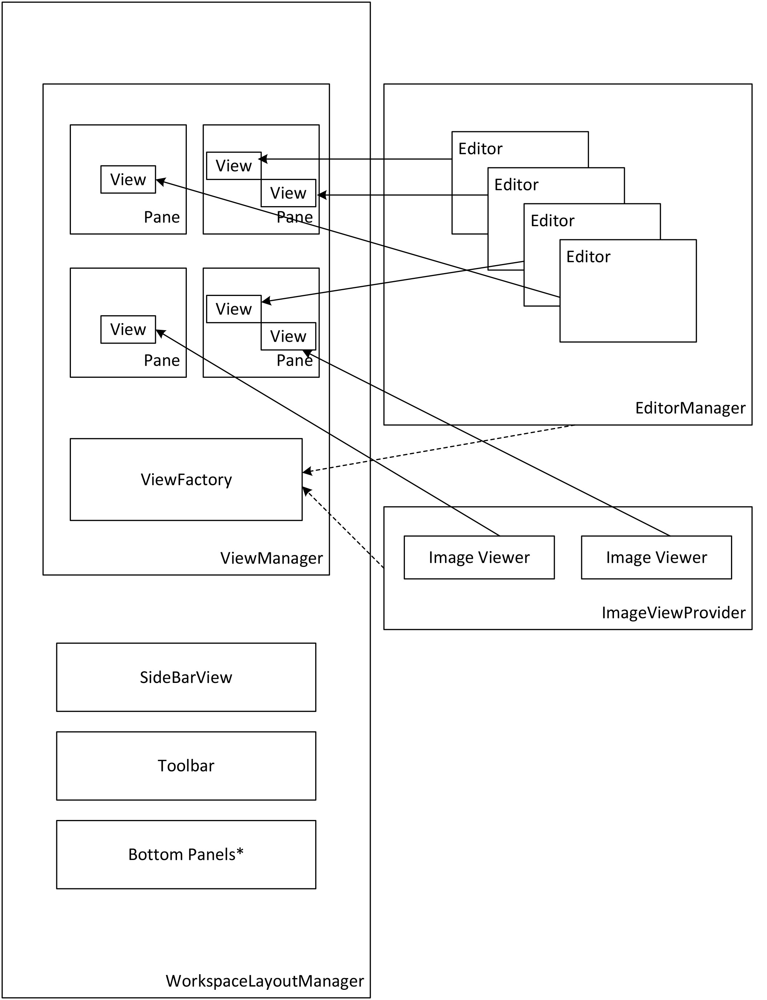

Refactoring Brackets to Support Split View with Multiple Documents requires quite a bit of hacking on the plumbing but there are only a few places that need to be heavily refactored to do so.  To break this work up in to smaller pieces, an accompanying document [SplitView Architecture Tasking](SplitView-Architecture-Tasking) has been created.

# Proposed Implementation 
This proposal calls for anything that wants to show a view in the "Editor Workspace Area" must be a Registered View Provider.  There are other ways to get views into this area but deserialization requires a method for views to be reconstructed at startup and this is done through a Registered View Provider. Registered View Providers expose methods to create a view for a given URI.  A ViewFactory will be responsible for maintaining the View Provider registry and invoke the Registered View Provider's `createView` method when a Registered View Provider indicates that it can create a viewer for a given URI.

Initially there will be 2 Registered View Providers: an Image View Provider and a Document Editor provider.  `EditorManager` will be the Registered View Provider for creating all document editors.

Workingset management moves from `DocumentManager` to `MainViewManager` -- although some legacy APIs, Events, Functions, Commands, etc..., will remain for some time to maintain backwards compatibility. The concept of Workingset is going away and all Workingset APIs are going to be renamed  `PaneViewList` and `WorkingSetView` is renamed `PaneViewListView`.  

Those items that are needed to maintain backwards compatibility have been identified and documented in the [SplitView Extension Migration Guide](SplitView-Extension-Migration-Guide) and are detailed in the section below on [Deprecating Legacy APIs](#deprecating-legacy-apis)

This proposal is an overview of the system along with functional details and implementation changes needed to build the SplitView feature.

## High Level Block Diagram


## EditorManager APIs
These `EditorManager` APIs that exist will remain for backwards compatibility and convenience but their implementation will move as described.

### EditorManager.getFocusedEditor
Reimplemented by moving the current implementation into `Editor` and invoking `Editor.getFocusedEditor()` for the `Editor` object of the focused pane.  The API will continue to work as it does today.

### EditorManager.getCurrentlyViewedPath
Reimplemented by moving the current implementation into `Editor` and invoking `Editor.getCurrentlyViewedPath` for the `Editor` object of the focused pane. The API will continue to work as it does today.

### EditorManager.getCurrentFullEditor
Reimplemented by moving the current implementation into `Editor` and invoking `EditorManager.getFocusedEditor().getCurrentFullEditor()`  The API will continue to work as it does today.

## View Layout APIs
### MainViewManager.setLayoutScheme(_rows_,_columns_)  
This API will change the layout to match _rows_ and _columns_.

### MainViewManager.setColumnWidth(_column_, _width_)  
### MainViewManager.setRowHeight(_row_, _height_)  
Update pane height/width. 

## View APIs
### MainViewManager.addView(_paneID_, _view_, _context_) 
This is how the viewFactory will add views to the layout but components can add views as necessary by calling `addView` and passing it the relevant data.  This gives the framework the flexibility to be able to create arbitrary views on the fly without a URI.  Calling this method directly, however, means that deserialization will not be able to reconstruct the view since there is no factory method for doing so.  See [`MainViewManager.registerViewProvider()`](#mainviewmanagerregisterviewproviderprovider) to register a view provider so that views can be reconstructed during the deserialization process.

This method will return a _viewID_ that is used to address the view.

_view_ is an object with the following interface:

```javascript
/** @type {string} **/
var title;

/** @type {boolean} **/
var modified;

function getUI();
/** @returns {{!jQueryObject}} **/
```

### MainViewManager.registerViewProvider(_provider_)

_provder_ is an object with the following interface:

```javascript
/** @type {string} **/
var displayname;

function canDecode(uri)
/** @returns {boolean} **/

function createViweFor(uri)
/** @return {!jQueryObject} **/

```
## MainViewManager.updateTitle(viewID)
Call this when the view's title has changed and you need to update it in the workingset and titlebar of the application.

## MainViewManager.revokeView(viewID)
Removes a view from the pane and `PaneViewList`.

## MainViewManager.getViewContext(viewID)
This will return any context data associated with the view when it was created

# PaneViewList API
The Implementation of these functions will move from `DocumentManager` to `MainViewManager`. See the section at the bottom of this document for a list of [deprecated Workingset APIs](#deprecating-legacy-apis) that need to be kept for backwards compatibility. 

Moving this functionality to `MainViewManager` is being done primarily because each view pane will have its own `PaneViewList` and `MainViewManager` manages the view panes so it makes sense to move it there. But, architecturally, it makes sense that this list is a property of the view because it's really a UI structure.

Extension Authors and 3rd party developers are encouraged to use other methods whenever possible to work with the set of open documents.  See the [SplitView Extension Migration Guide](SplitView-Extension-Migration-Guide) and the section below on *[Workingset Alternatives](#workingset-alternatives)* for more information.

## PaneViewList APIs
`PaneViewList` APIs will replace the `WorkingSet` APIs and their implementation will be migrated from `DocumentManager`. Some of the `WorkingSet` APIs will continue to exist in `DocumentManager` to maintain backwards compatibility.  The `PaneViewList` APIs have the same functionality as the `Workingset` APIs from previous versions of Brackets except they will take a `paneId` to identify which `PaneViewList` to work on.

Most of the `PaneViewList` APIs will take one of these Special Pane IDs for `paneId` in addition to valid paneIds:
```text
------------------------+-----------------------------------------------------------------------------------------------------
Constant                | Usage
------------------------+-----------------------------------------------------------------------------------------------------
ALL_PANES               | Perform the operation on all panes (e.g. search for fullpath in all Pane View Lists)
FOCUSED_PANE            | Perform the operation on the currently focused pane (can also use MainViewManager.getFocusedPane())
------------------------+-----------------------------------------------------------------------------------------------------
```
### MainViewManager.getPaneViewList(_paneId_)  
### MainViewManager.addToPaneViewList(_paneId_, _file_, _open_)  
### MainViewManager.addListToPaneViewList(_paneId_, _files_)
### MainViewManager.removeFromPaneViewList(_paneId_, _file_) 
### MainViewManager.removeListFromPaneViewList(_paneId_, _files_)
### MainViewManager.swapPaneViewListIndexes(_paneId_, _files_)
### MainViewManager.sortPaneViewList(_paneId_, _files_)

### MainViewManager.findInPaneViewList(_paneId_, _file_)  
### MainViewManager.findInPaneViewListAddedOrder(_paneId_, _file_)    
Returns {paneId: _paneId_, index: _index_) or undefined if not found

## PaneViewList Events  
_MainViewManager Events will add `paneId` to event data_

### MainViewManager.paneViewListCreated
### MainViewManager.paneViewListDestroyed
### MainViewManager.paneViewListSort
### MainViewManager.paneViewListAdd
### MainViewManager.paneViewListAddList
### MainViewManager.paneViewListRemove
### MainViewManager.paneViewListRemoveList
### MainViewManager.paneViewListDisableAutoSorting

## Pane Events
### MainViewManager.paneCreated
### MainViewManager.paneDestroyed
### MainViewManager.activePaneChanged
### MainViewManager.currentlyViewedFileChanged 

## EditorManager Events 
_provided for backwards compatibility but adds PaneId as Event Data_
### EditorManager.activeEditorChanged
### EditorManager.fullEditorChanged

## ProjectManager Events
### ProjectManager.openFileListChanged

# Implementing the Layout Manager
The initial implementation will be mostly handled by `MainViewManager` but a `MainViewLayoutManager` object will be created just to help handle the layout.  We shouldn't need to build for advanced layout mechanics since we only need, at most, 2 panes.  Support for arbitrary rows and columns can be built into the `MainViewLayoutManager` builder at a later date.

Whether or not the initial implementation uses a `MainViewLayoutManager` object is an implementation detail that will be decided when the feature is implemented.

**Layout Rules:**
* Only 1 pane or 1 row and 2 columns or 2 rows and 1 column are initially supported
* Panes, when created, will initially show the Brackets logo interstitial screen until the corresponding view for that pane has loaded its content.
* When a pane is destroyed, all views in the corresponding `PaneViewList` for that pane are moved to another pane and that pane's `PaneViewList` is updated.  Since there are, at most, 2 panes in the initial implementation, this is just a matter of combining the `ViewPaneList` with the remaining Pane's `ViewPaneList`.  This will generate a `viewPaneListRemoveList` event is generated for the pane losing views and a corresponding  `viewPaneListAddList` event is generated for the pane who is receiving the the views.

`WorkspaceManager` computes the new size of `#editor-holder` in its the `window.resize` event handler and triggers an event to resize that the `MainViewManager` object subscribes to.  Currently `WorkspaceManager` only computes the Height and passes that as data but it needs to also compute Width and pass that as well so that the `MainViewLayoutManager` object can verify that the editor holder doesn't get too narrow to handle 2 editor instances.  At the point that it is too narrow then it will need to start resizing other columns to get a decent layout.  This algorithm becomes more complex with more columns and rows.  For now it can be a matter of going to something like 50%.  We may want to bump up the shell's minimum width as well to avoid getting too small.

## Column Width/Row Height Rules
_height_ and _width_ are expressed in percentages when affixing the CSS to the columns (e.g. `width: 40%`).  Doing it in a percentage and only applying to all except the rightmost column and bottom most row will yield a fluid layout.  The API will reject setting the width on the rightmost column.  For the initial implementation we may just go with 50% splits all around without the ability to resize. 

#Implementing Pane Management
`ViewManager` will manage a `PaneViewList` for each of its View Panes. This may be abstracted and delegated into a `Pane` object if implementation starts to get to messy but the API to get the `PaneViewList` will be through the `MainViewManager` object.  Because the `ViewPaneList` is being decoupled from `DocumentManager`, the list will no longer be a collection of `Document` objects.  It will be a collection of file names.  

*NOTE:* To abstract the `PaneViewList's` location, each view pane is addressed by _paneId_ rather than row,col.  Valid _paneId_ values cannot be `false, 0, null, undefined or ""` so that they can be used in `truthy` tests.

Clients can use the [Special Pane IDs](#paneviewlist-apis) for `PaneViewList` APIs to avoid having to maintain a reference to the pane in which a view belongs.

# Implementing PaneViewListViews
`PaneViewListView` objects are created when the event `viewPaneCreated` is handled.  `SideBarView` will handle this event and create a `PaneViewListView` object (which is bound to the pane's `PaneViewList` object) for the pane (passed as event data).

`#open-files-container` is a container which contains one or more `.working-set-container` divs in the DOM. Several 3rd Party Extensions rely or use the `#open-files-container` div. The extensions which style the elements will continue to work. 

# Supporting Images in PaneViewLists
To support images in split view, we will need to change the rules to allow for images in `PaneViewLists`. This means that callers of the new `PaneViewList` APIs will need to check to ensure they can operate on a file by getting its file type from the language manager or by checking its extension. 

`PaneViewLists` will basically just be a list of files that may or may not have a `Document` object owned by the `DocumentManager`.  The deprecated API, `DocumentManager.getWorkingSet()`, will use the `PaneViewList` APIs to filter out any files that do not have an associated `Document` object.

# Implementing PaneViewListView Context Menus
This currently works by listening to `contextmenu` events on the `#open_files_container`.  This will change to listen to `contextmenu` events on an `.open_files_container` and the `PaneViewListView` will maintain the _paneId_ from the `EventData` it was passed during creation so the menu can operate on the correct pane's `ViewPaneList`.

Right clicking on a `ViewPaneList` item will also trigger a focus action on view for that `ViewPaneList` item causing the view to gain focus.  

The core extension, `CloseOthers`, will be retooled to work on the `PaneViewList` for the pane associated with the `PaneViewListView` that it manages.

```javascript

DefaultMenus:
        $("#open-files-container").on("contextmenu", function (e) {
            working_set_cmenu.open(e);
        });

Becomes:
        $(".working-set-container").on("contextmenu", function (e) {
            e.paneId = this._paneId;
            working_set_cmenu.open(e);
        });

```

# Workingset Alternatives
Although they aren't called Workingsets anymore, extensions making use of the `WorkingSet` APIs today are encouraged to migrate to these new convenience methods rather than just accessing `ViewList` directly if possible.  

## ProjectManager.getAllOpenFiles()
Returns a list of all open files

## DocumentManager.getAllOpenDocuments()
Returns a list of all open documents -- including documents which are in a PaneViewList but not yet opened, documents which have been opened in inline editors but not part of a PaneViewList and opened but not modified or added to any PaneViewList.

# Deprecating Legacy APIs
```text
-------------------------------------+--------------------------------------------------------
API                                  | Calls...
-------------------------------------+--------------------------------------------------------
DocumentManager.getCurrentDocument() | EditorManager
                                     |    .getFocusedEditor()
                                     |    .getDocument();
-------------------------------------+--------------------------------------------------------
DocumentManager.getWorkingSet()      | $.map(ViewManager.getPaneViewList(ALL_PANES, …),
                                     |        function(fullPath) {
                                     |           if (DocumentManager.isDocument(fullPath)) {
                                     |               return fullPath; 
                                     |        }
                                     | });
-------------------------------------+--------------------------------------------------------
DocumentManager.findInWorkingSet()   | return ViewManager
*only used by pflynn                 |    .findInPaneViewList(ALL_PANES, ...).index || -1;
-------------------------------------+--------------------------------------------------------
DocumentManager.addToWorkingSet()    | return ViewManager
                                     |    .addToPaneViewList(FOCUSED_PANE, ...);
-------------------------------------+--------------------------------------------------------
DocumentManager.addListToWorkingSet  | return ViewManager
                                     |    .addListToPaneViewList(FOCUSED_PANE, ...);
-------------------------------------+--------------------------------------------------------
DocumentManager.removeFromWorkingSet | return ViewManager
                                     |    .removeFromPaneViewList(ALL_PANES, ...);
-------------------------------------+--------------------------------------------------------
```

# Deprecating Legacy Events
The following Events will be kept on the `DocumentManager` object to maintain backwards compatibility but will just republish `MainViewManager` events. 


### DocumentManager.workingSetAdd                
### DocumentManager.workingSetAddList            
### DocumentManager.workingSetRemove             
### DocumentManager.currentDocumentChange 
_Fired when handling `EditorManager.fullEditorChanged`_

# Stubbing Modules

Both `WorkingSetView` and `PanelManager` will need to be stubbed and deprecation warnings will be added to them when used.

# Opportunistic Cleanup

The following `EditorManager` functions will move to `Editor` and are opportunistic refactorings since we're working in that code.  These refactorings aid in the overall implementation but aren't necessary.

```text
------------------------+-----------------------------------+-------------------------------------
 Name                   | Usage                             | Disposition                  
------------------------+-----------------------------------+-------------------------------------
_openInlineWidget       | Internal Inline Widget Management | Moves to Editor without impunity
------------------------+-----------------------------------+-------------------------------------
_toggleInlineWidget     | Command Handler                   | Current Implementation moves to 
                        |                                   | Editor
                        |                                   | Command handler will call
                        |                                   | Editor
					    |                                   |   .getFocusedEditor()
						|                                   |    .toggleInlineWidget()
------------------------+-----------------------------------+-------------------------------------
closeInlineWidget       |                                   | Moves to Editor
						|                                   | calls hostEditor.closeInlineWidget()
------------------------+-----------------------------------+-------------------------------------
getInlineEditors        |                                   | Moves to Editor
						|                                   | calls hostEditor.getInlineEditors()
------------------------+-----------------------------------+-------------------------------------
getFocusedInlineWidget  |                                   | Doesn't move but passes through to
                        |                                   |    getFocusedEditor()
						|                                   |      .getFocusedInlineWidget();
------------------------+-----------------------------------+-------------------------------------
                             
```

## Break up `Editor` up into `Editor` and `EditorModule`

The community has suggested splitting `Editor` into 2 parts. One with only the `Editor class` and all `prototype methods` (`EditorModule`). Another for the `non-prototype methods` including the ones added in as part of the refactorings described above. These would remain as `Editor`. This is how `Document` is split and make sense to do the same for the `Editor`.

## Refactor `Editor` into logical groupings

* Move all the tab/indent code into a new utility module.  (If we eventually do auto-indent-size sniffing, we could put that code there too).
* Hoist out some of the selection-related APIs into a new SelectionRanges object or a SelectionUtils module (stuff like convertToLineSelections() and selectWordAt().
* Move most of the displayErrorMessageAtCursor() into a more UI-oriented popover module.
* Make an OuterEditor/FullEditor subclass and move all the inline widget management APIs into that.
* Move the getMode/LanguageFor*() APIs into TokenUtils, perhaps.
* Deprecate & eventually move all the per-preference static APIs?  Or move them into a separate EditorPreferences module?

## Commands (opportunistic cleanup)

The following list of commands will move from `DocumentCommandHandlers` along with their corresponding implementation into a new module -- `ViewCommandHandlers`.  We will also remove "file." from the command name and rename the commands to "cmd.", deprecating the old command ids in the same fashion the find commands were deprecated using getters.

### cmd.addToPaneViewList
### cmd.open	
### cmd.rename	
### cmd.delete
### cmd.close
### cmd.closeAll
### cmd.closeList
### cmd.navigate.nextDoc
### cmd.navigate.prevDoc
### cmd.navigate.showInFileTree


Raw data can be found here:
[splitview architecture notes](splitview-architecture-notes)