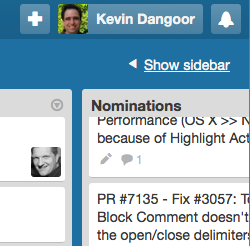
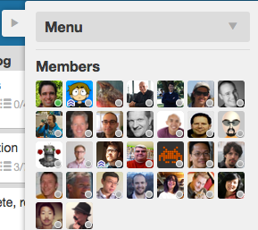
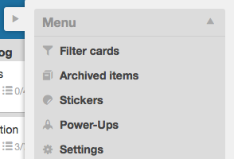
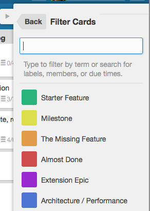

Is there something you'd like to see in Brackets?

We keep our backlog of feature ideas on our [Trello board](https://trello.com/b/LCDud1Nd/brackets). You can **vote for the features you'd most like to see** by clicking on a card and clicking the "vote" button.

## Some of the most popular feature requests

* [Automatic updates](https://trello.com/c/dCplDYlN/578-auto-update-mechanism-shell)
* [FTP upload to server](https://trello.com/c/anjphhsw/610-ftp-upload-to-server)
* [SASS advanced code intelligence](https://trello.com/c/8L4F4HAl/354-sass-advanced-code-intelligence)
* [Split view with multiple documents](https://trello.com/c/8YAFyAZD/500-4m-1s-split-view-multiple-documents)
* [Live Preview with LESS](https://trello.com/c/WkKpIVvd/468-5-live-development-less-support)
* [Split view in the same document](https://trello.com/c/GezHZcCx/390-m-split-view-same-document)
* [CSS code hinting for colors](https://trello.com/c/YEd0m9Il/755-3-css-code-hinting-colors)
* [HTML code hinting for CSS class and ID](https://trello.com/c/doY5Dbpb/529-3-html-code-hinting-css-class-and-id)
* [Code folding](https://trello.com/c/JXiiVluW/278-41-code-folding-collapse-expand-blocks-5) (expand/collapse blocks of code)
* [JSHint support](https://trello.com/c/SQhvGHri/498-3-jshint-support)
* [User specified keyboard shortcuts](https://trello.com/c/3mZwu1DE/352-2-user-specified-keyboard-shortcuts-for-commands-in-json)
* [Extension enable/disable](https://trello.com/c/DtVjozXu/865-2-extension-enable-disable)
* [Theme support](https://trello.com/c/y5ed9WKY/460-3-theme-support)
* [Live Preview with browsers other than Chrome](https://trello.com/c/wdES3HqH/1008-5-research-live-development-w-open-protocol)

Don't see the feature that's on your mind? Take a look below for tips on finding the feature you're interested in.

## How to find a feature on Trello

There's a good chance that the feature you're interested in has already been suggested and you just need to upvote it. We have a lot of cards on our Trello board, which can make finding the one you want a little challenging.

Trello has a search box at the top, which may find what you're looking for. I often use the slightly hidden "Filter" feature:

Here's how you do it:

**Show the Sidebar**

**Open the Menu**

**Click on the Filter option**

**Enter your search or select labels**

For example, if you type `SASS` into the filter box, Trello will show all of the cards related to adding [SASS](http://sass-lang.com/) features.

## Don't see the feature you're interested in?

Feel free to put a request in [via GitHub issues](https://github.com/adobe/brackets/issues/new). The team will periodically review these and move them into Trello.